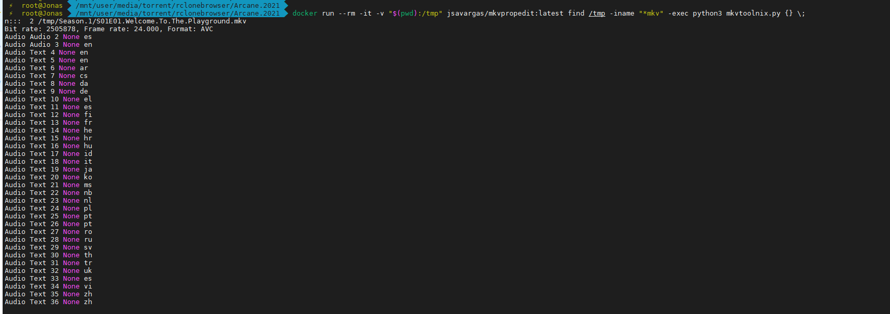

# python-mkvpropedit


## MODO DE USO


```bash

python3 mkvtoolnix.py file.mkv

find /path/files/ -iname "*mkv" -exec python3 mkvtoolnix.py {} \;

```

## MODO DE USO DOCKER


```bash

docker-compose run --rm mkvpropedit sh

docker run --rm -it -v "$(pwd):/tmp" jsavargas/mkvpropedit:latest find /tmp -iname "*mkv" -exec python3 mkvtoolnix.py {} \;
 
 ```
