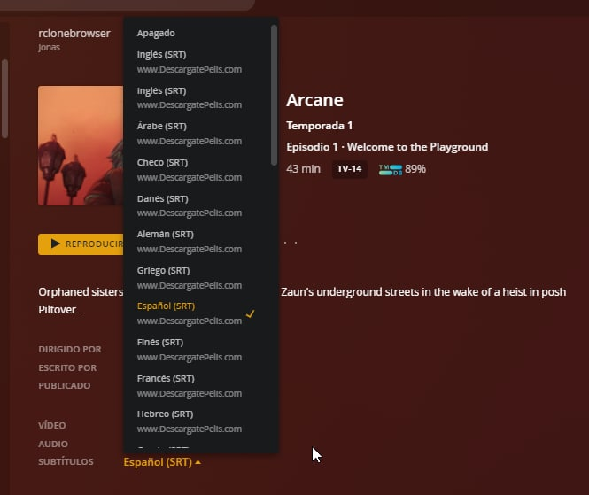
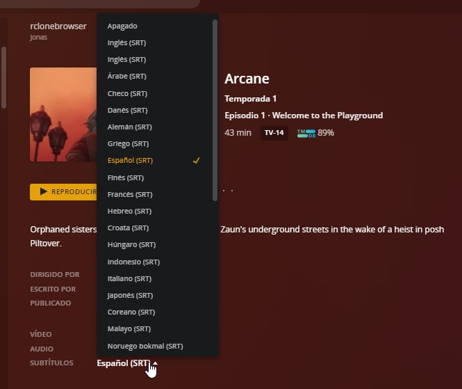

# python-mkvpropedit

      mkvpropedit - Elimina todo el spam en las propiedades existentes de los archivos Matroska
```
mkvpropedit --tags all: --delete title --edit track:a1 --delete name --edit track:a2 --delete name --edit track:s1 --delete name --edit track:s2 --delete name --edit track:s3 --delete name --edit track:s4 --delete name --edit track:s5 --delete name --edit track:s6 --delete name --edit track:s7 --delete name --edit track:s8 --delete name --edit track:s9 --delete name --edit track:s10 --delete name --edit track:s11 --delete name --edit track:s12 --delete name --edit track:s13 --delete name --edit track:s14 --delete name --edit track:s15 --delete name --edit track:s16 --delete name --edit track:s17 --delete name --edit track:s18 --delete name --edit track:s19 --delete name --edit track:s20 --delete name --edit track:s21 --delete name --edit track:s22 --delete name --edit track:s23 --delete name --edit track:s24 --delete name --edit track:s25 --delete name --edit track:s26 --delete name --edit track:s27 --delete name --edit track:s28 --delete name --edit track:s29 --delete name --edit track:s30 --delete name --edit track:s31 --delete name --edit track:s32 --delete name --edit track:s33 --delete name  --edit track:v1 --delete name --delete-attachment 1  /tmp/File.mkv


```

### Antes 


### Despues

## MODO DE USO


```bash

python3 mkvdelspam.py file.mkv

find /path/files/ -iname "*mkv" -exec python3 mkvdelspam.py {} \;
find /path/files/ -iname "*mkv" -exec mkvdelspam {} \;

```

## MODO DE USO DOCKER


```bash

docker-compose run --rm mkvpropedit sh

docker run --rm -it -v "$(pwd):/tmp" jsavargas/mkvpropedit:latest find /tmp -iname "*mkv" -exec  mkvdelspam {} \;
 
 ```

## **Requirements:**
- python3
- mediainfo
- mkvtoolnix

## **Changelog:**

**v1.1 (13/03/2022/):**
- Update mkvdelspam.py
- Fixed bugs
- Added more bugs to fix later
- Support for versions without pymediainfo

